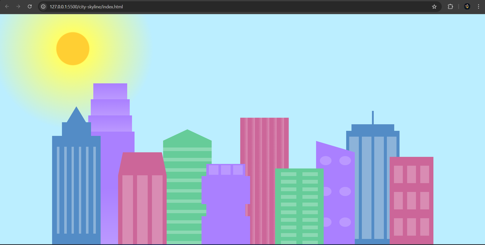

# HTML + CSS Projects

This repository contains responsive and creative HTML/CSS projects built as part of the [freeCodeCamp](https://www.freecodecamp.org/) curriculum. These projects demonstrate core concepts like Flexbox, Grid, responsive design, and animations.

## Projects

### 🌆 [City Skyline](./city-skyline)

A skyline built using HTML and custom CSS variables. Demonstrates creativity using shapes and layout techniques.

---

### 📰 [Magazine Grid](./magazine-grid)

A CSS Grid layout mimicking a magazine article page.

---

### 🖼️ [Photo Gallery](./photo-gallery)

A responsive image gallery built with CSS Flexbox and media queries.

---

### 🎹 [Responsive Piano](./responsive-piano)

A piano interface designed using Flexbox and responsive design.

---

## 🧠 Skills Demonstrated

- Responsive layouts (media queries, grid, flexbox)
- Semantic HTML
- CSS animations and transforms
- Accessibility & mobile-first design
